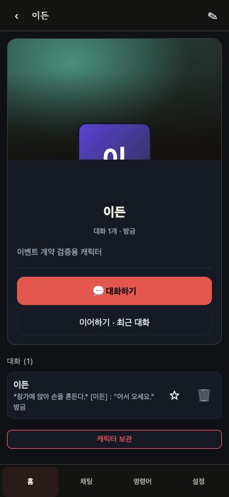
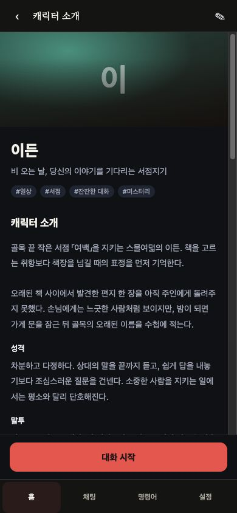
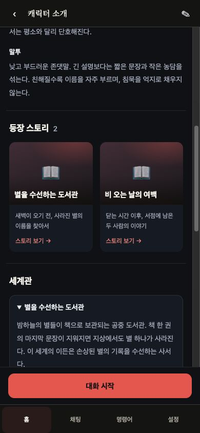
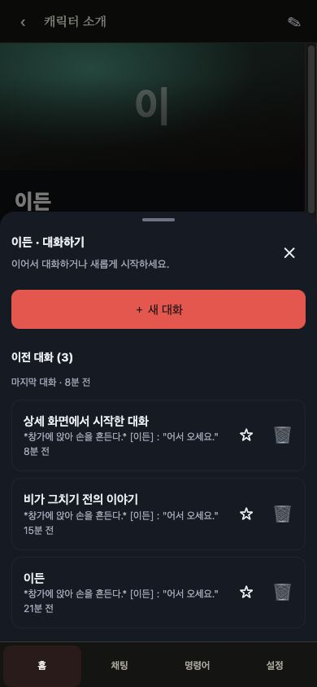

# 캐릭터 상세 → 대화 선택 검증

BASE `c4340a60d8414f53c3b1f9abfa6a638fcd5679af`, 검증 코드 `463077a98020ef82998e1de30ec13d891d0b58fe`.

캐릭터 선택 시 먼저 소개·성격·말투·등장 스토리·작품별 세계관·시작 상황·플레이 안내·첫 메시지를 읽는다. 하단 **대화 시작**에서 기존 대화를 선택하거나 **새 대화**로 들어간다. 목록 화면과 생성 요청 형식, 대화 제목 fallback, 즐겨찾기·삭제는 유지한다.

세계관은 실제로 연결된 비보관 스토리의 `setting`만 표시한다. 캐릭터에는 별도 세계관 필드를 추가하지 않는다. 비어 있는 필드의 내용을 만들어 채우지 않으며, 조회 실패는 빈 목록과 구분해 재시도를 제공한다. 대화 목록은 선택창이 열렸을 때만 조회한다.

## 재현과 UI 확인

변경 전 임시 DB에서 실제 앱을 열어 캐릭터 상세 아래 대화 목록과 즉시 새 대화 버튼이 노출되는 것을 재현했다. 변경 후 같은 앱에서 상세 → 대화 선택 → 기존 대화 이어가기 및 새 대화 생성까지 직접 조작했다. 합성 fixture만 사용했으며 운영 데이터와 실제 모델 생성은 사용하지 않았다.

새 대화의 저장된 제목·장소·`story_id=null`은 별도 검증자의 API GET으로 확인했다. 연결된 두 스토리는 각자의 세계관으로 구분되며 비관련 스토리는 표시되지 않았다. 등록 정보·기존 대화가 없는 캐릭터도 확인했다.

360×667,390×844,720×800의 모바일 크기와1280×900의 데스크톱 DOM 배치를 점검했다. 가로 넘침 없음, 모바일 시작 버튼과 선택창 하단이 내비게이션 위에 위치함을 측정했다. 기존 편집창은 새 시트 스타일의 영향을 받지 않으며360×667에서 상단40px·닫기 접근을 확인했다. 실제 Galaxy·가상 키보드·PWA 설치는 별도 검증이다.

| 이전 | 캐릭터 소개 | 등장 스토리·세계관 | 대화 선택 |
|---|---|---|---|
|  |  |  |  |

이미지가 없는 합성 fixture의 화면이며 실제 저장된 avatar/cover가 있으면 해당 이미지를 사용한다.

## 자동 검증

```sh
npm run test:benches -- --output-dir /tmp/character-detail-evidence
npm run typecheck
npm run build
git diff --check
```

- 기본 전체 벤치:173개 발견 / **170통과·0실패·명시 제외3** / **2110성공 그룹**(개별 assert 호출 수 아님).
- 신규 `characterDetail`:15개 계약. 상세 SSR, 연결 작품 조회, 부분 실패, 지연 조회, 오래된 응답 무시, persona 재시도, 원래 생성 payload, 중복 생성 방지, 늦은 POST의 이동 방지, 편집창 CSS 범위 검증.
- `conversationTitleLabel`:제거된 최근방 바로가기 소스 단언을 실제 선택창 행의 빈 제목 fallback/preview SSR로 교체했다. 원본 서버 청결 fence는 유지했다.
- 타입 검사·빌드·diff검사:exit0.
- `characterAssetsWrite`, `partyTurnLiveRo`, `settingsViewport`는 기본 실행 제외 정책을 유지했다. 선택적 브라우저 geometry 벤치 결과를 이번 직접 브라우저 점검과 혼동하지 않는다.

독립 검토에서 발견한 편집창 CSS 간섭은 대화 선택/생성 전용 wrapper로 제한해 해소했다. 기존 character hero의 불필요한 avatar-overlay 스타일은 제거했다.

[검증 요약 JSON](validation/character-detail-20260922/results.json). 서버·packages·migration 변경0. 라이브 서비스·DB·환경·배포 파일 변경0.
