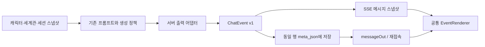

# ChatEvent v1: 개인용 대화 실행 경로

목표는 캐릭터 선택 → 세션 생성 → 스트리밍 → 저장 → 재접속의 표시 계약을 하나로 만드는 것이다. 기존 beat(focused)와 dialog(ensemble)의 생성 정책, 기억 선택, 장면 상태 계산은 유지한다. 마켓·추천·결제·이미지 확장은 이 변경에 포함하지 않는다.

## 이전 데이터 흐름

| 경계 | 변경 전 |
| --- | --- |
| 제작 | `characters`, `stories`, persona 및 conversation snapshot |
| 생성 | `routes/chat.ts`: `generate`, `generateBeat`, `generateDialog` |
| 파싱 | 1:1 choices/content 정제, beat N/F/E 조립, dialog `parseScript` |
| 저장 | `db/tree.ts`: `messages.content` + `meta_json.block_kind/speaker_*` |
| SSE | `start` → `token.text` → `done.message`, 파티의 추가 행은 `aux.message` |
| 재접속 | `GET /api/conversations/:id` → `getPath` → `messageOut` |
| 화면 | `useChat` 원문 합치기 → `ChatPage`/`view` 정제 → 파티/일반 별도 표시 |

서버 내부 `PartyTurn`과 웹 `PartyBlock`은 유사한 별도 타입이었다. DB나 SSE가 공통 이벤트를 전송하지 않았고 클라이언트가 원문을 다시 해석했다. 임시 모델에서 `<think>INTERNAL_FIXTURE</think>`가 생성 중과 완료 후 모두 보이는 문제를 실제 브라우저로 재현했다.

## 새 경계



- 타입의 원본은 `@rpchat/contracts/chat-event`다. 이 패키지는 타입 선언만 포함하며 React, DB, 모델 SDK에 의존하지 않는다.
- `apps/server/src/contracts/chatEventAdapter.ts`가 표시용 텍스트 해석, 화자 식별, 내부 표식 제거를 담당한다.
- `MessageOut`에 `eventVersion: 1`, `events: ChatEvent[]`를 추가한다. 기존 `content`, `meta`, status, sibling 정보는 유지한다.
- 새 assistant content에서 명시적 thought 태그와 `속마음:` 블록을 제거하고, 새 thought 행을 생성하지 않는다. 과거 thought 행은 이벤트 배열이 비어 있어 화면에 표시되지 않는다. 과거 DB를 일괄 수정하거나 삭제하지 않는다.
- 웹은 assistant 원문을 파싱하지 않는다. 사용자가 메시지를 편집할 때는 기존 content 필드를 사용하며 저장 시 서버가 이벤트를 다시 만든다.

## 이벤트

| type | 표시와 처리 |
| --- | --- |
| `dialogue` | `[이름] : "대사"`. actorId와 actorName은 명확한 근거가 없으면 null 가능 |
| `narration` | 흐린 이탤릭 서술 |
| `system` | 낮은 강조도 메시지. 기존 header/info/ui/panel은 presentation과 구조화 payload로 전달 |
| `state_patch` | 예약된 상태 계약. 렌더러가 상태를 직접 적용하지 않음 |
| `error` | 오류 표시 계약. 기존 SSE error와 메시지 status 처리도 유지 |

이벤트 id는 `messageId:index`다. 개별 토큰마다 새 이벤트를 append하는 방식이 아니라, 해당 메시지의 배열 전체를 교체한다. 출력 해석이 진행되면서 이벤트 종류나 수가 바뀔 수 있으므로 id를 전역 이벤트 로그 또는 영구 상태 변경 키로 사용하지 않는다.

이름이 같은 캐릭터는 임의로 하나를 선택하지 않는다. 명시적 speaker id가 있는 기존 파티 행은 그 id를 사용한다. 허용된 dialog 화자를 이름으로 특정할 수 없는 대사는 기존 파서의 서술 fallback을 사용한다. 명시적 이름을 가진 일반 메시지는 이름을 보존하되 식별할 수 없는 actorId는 null이다.

## 저장과 호환

새 행 또는 본문 변경은 `meta_json.chat_event_version = 1`과 `meta_json.events`를 content와 같은 INSERT/UPDATE 문에서 저장한다. 스키마 추가와 live migration은 없다. 상태/메타 변경에서 화자 스냅샷을 사용해 이름 변경 뒤 기존 응답의 화자가 달라지는 것을 방지한다.

신규 이벤트가 없는 과거 행은 `messageOut`에서 서버 어댑터로 변환한다. 읽기 과정에서 원문이나 메타를 재저장하지 않는다. 저장된 v1 이벤트는 유효한 타입인지 확인하고 그대로 사용한다. 오래된 클라이언트는 기존 필드를 계속 받는다. 새 클라이언트가 구서버와 연결되면 원문을 추측해 표시하지 않고 새로고침/서버 갱신 안내를 표시한다.

## SSE v1 추가 필드

기존 `data: {JSON}\n\n` framing과 `start/token/aux/done/error` 종류를 유지한다.

```json
{"type":"start","generationId":"g1","messageId":"m1","eventVersion":1,"message":{"id":"m1","events":[],"eventVersion":1}}
{"type":"token","text":"안녕","messageId":"m1","eventVersion":1,"events":[{"type":"dialogue","id":"m1:0","actorId":"c1","actorName":"이든","text":"안녕"}]}
```

위 start.message는 새 필드만 보여주는 축약 예시다. 실제로는 완전한 MessageOut이다. token.text는 구클라이언트용 안전한 증가분이며 새 클라이언트는 events만 사용한다. `aux.message`와 `done.message`도 GET과 동일한 eventVersion/events를 포함한다.

- 일부만 도착한 private 태그는 다음 조각이 올 때까지 보류한다.
- dialog 스트림은 화자 구분이 확정된 행부터 표시한다.
- `done`/`aux`는 메시지 id로 교체하므로 재전달이 중복 행을 만들지 않는다.
- EOF 전 terminal 이벤트가 없으면 오류로 감지하고 GET으로 서버 상태를 다시 읽는다. 생성이 계속 중이면 폴링한다.
- 명시적 중단은 기존 abort 엔드포인트를 사용한다. 네트워크 단절은 서버 생성 취소와 구분한다.
- 방을 옮긴 뒤 늦게 도착한 이전 방의 GET/SSE가 현재 방을 덮어쓰지 못하도록 요청 범위를 확인한다.

이는 전송 중복에 대한 처리다. 서로 다른 HTTP 요청으로 사용자가 같은 내용을 다시 보내는 경우를 전역 request id로 합치는 기능은 추가하지 않는다.

## 검증과 다음 단계

`npm run test:chat-events`는 10개 고정 fixture, 서버 어댑터 → 실제 React 렌더, 실제 Fastify 경로 → 임시 SQLite → SSE → 재접속, 중단/실패/재생성, 스트림 수신기를 검증한다. `bench/chatEventUiFixture.py`로 빌드된 앱을 임시 DB와 모의 모델에서 실행할 수 있다.

`npm run typecheck`, `npm run build`와 관련 기존 bench를 함께 실행한다. 모의 모델 검증은 실제 모델의 한국어 품질이나 Galaxy 기기의 감각 검증을 대신하지 않는다.

전체 레거시 제거(S4)는 별도 단계다. 기존 prompt/parser와 export의 raw content, 과거 데이터 저장 필드는 아직 필요하다. 실제 사용 데이터의 신규 계약 읽기 검증 후 사용하지 않는 어댑터를 제거한다. 범용 모델 공급자 추상화나 대규모 디렉터리 이동은 하지 않는다.
