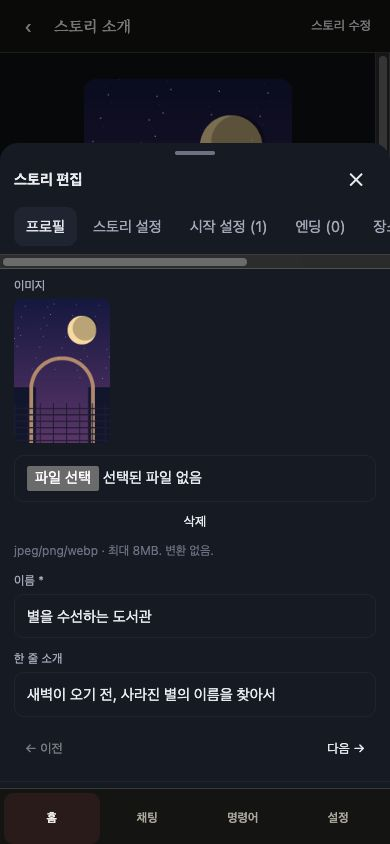
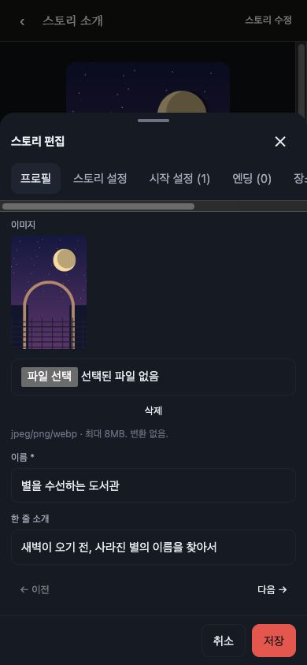

# 모바일 편집창 하단 버튼 겹침 수정

BASE `ff4bc38`, 검증 코드 `a66d89cc6e79d460edc7e54ead60a4cca93a0845`.

스토리 편집창에서 저장·취소가 하단 탭 뒤에 가려졌다. 390×844 실제 브라우저에서 취소 버튼 중심의 클릭 대상이 명령어 탭인 것을 확인했고, 라이브 내용을 변경하지 않은 채 합성 DB에서도 동일하게 재현했다. 이전 검증의 창 높이·위치만으로는 버튼의 실제 클릭 가능 여부를 증명하지 못했다.

공통 편집 Modal에만 별도 계층을 지정했다. 하단 메뉴 40 < 편집창 배경 44 < 편집창 45 < 확인창 배경 50 < 확인창 51을 유지한다. 일반 BottomSheet와 대화 선택창의 하단 여백, 서버·프롬프트·마이그레이션은 변경하지 않았다.

| 수정 전 | 수정 후 |
|---|---|
|  |  |

이미지는 합성 데이터다. 수정 후 같은 좌표가 각각 취소·저장 버튼을 가리키며, 실제 취소 클릭은 소개 화면에 머물고 실제 저장 클릭은 저장됨을 표시했다. [UI 결과](validation/editor-overlay-20260923/ui-verification.json).

Node22의 깨끗한 코드 커밋에서 `npm run test:benches -- --output-dir /tmp/editor-overlay-evidence`: **173 PASS / 0 FAIL / 기존 명시 제외 3**, 성공 그룹 2137. 타입 검사·웹/서버 빌드·diff 검사 통과. [전체 결과](validation/editor-overlay-20260923/bench-results.json). 새 회귀 검사는 실제 Modal 요소와 CSS/확인창 계층을 비교하고 저장·닫기 콜백과 일반 BottomSheet 유지도 확인한다. 기존 검증 fence는 변경하지 않았다.

실제 Galaxy 기기와 가상 키보드는 별도 확인 범위다. 저장 동작은 합성 DB에서만 수행했다.
