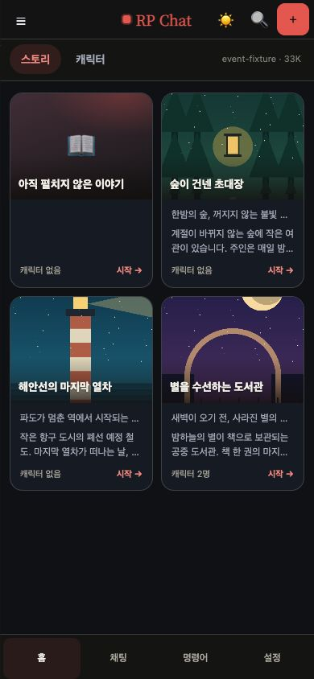
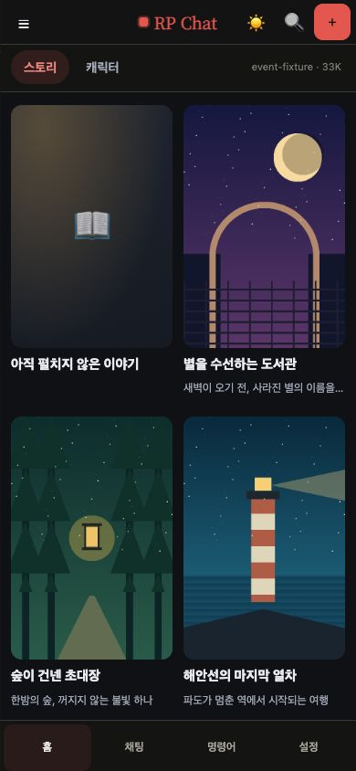
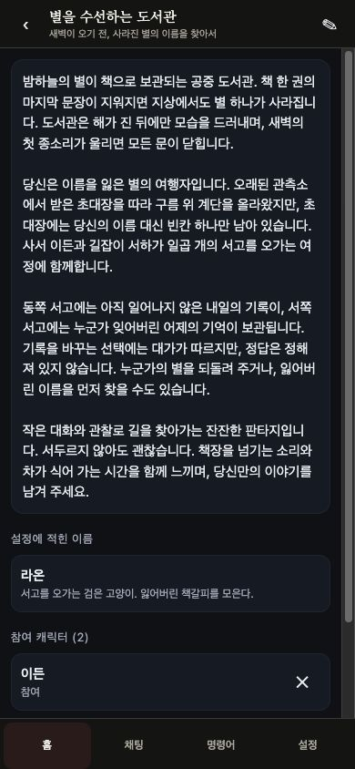
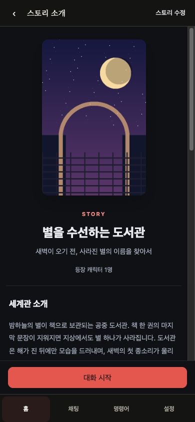
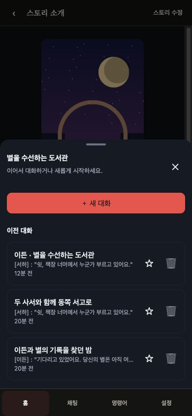

# 스토리 목록·소개·대화 선택 검증

BASE `1297ddf760af5428c0f83520c08fc82c0f5d0fba`, 검증 코드 `2a6d883a52ec041eb1b88e579b46e43c3d7d08f2`. Node `v22.16.0`에서 실행했다.

스토리 목록은 캐릭터 카드보다 세로로 긴 2:3 표지와 제목·짧은 소개를 보여 준다. 스토리 선택 시 세계관·등장인물·시작 상황·장소를 먼저 읽고, **대화 시작**에서 기존 대화를 이어가거나 새 대화를 만든다. 캐릭터 목록 구성은 유지한다.

새 대화는 스토리에 저장된 활성 참여 명단 전체로 시작한다. 순서를 유지하며 보관·사용 불가 캐릭터와 중복은 제외한다. 첫 ID는 기존 표시용 슬롯이며 화자 우선권이 아니다. 명단이 비었거나 12명을 초과하면 생성을 막고 **스토리 수정 → 시작 설정**으로 안내한다. 추가 오프닝 선택은 유지하며, 기존 대화의 스냅샷은 바꾸지 않는다.

대화 목록은 선택창을 열 때 조회한다. 서버의 `GET /api/conversations`에 `storyId`와 `offset`을 추가해 **스토리 필터를 LIMIT 전에** 적용한다. 50개씩 더 읽을 수 있고 캐릭터 전용 대화는 섞이지 않는다. 생성 API·프롬프트·DB 스키마 변경과 신규 마이그레이션은 없다.

## 실제 UI 확인

변경 전 같은 합성 데이터로 짧은 표지 카드와 관리·캐릭터 선택 중심 상세를 재현했다. 변경 후 빌드된 앱을 직접 조작해 다음을 확인했다. 브라우저에서 로드한 최종 JS는 `/assets/index-C1VpAMOa.js`다.

- 소개 → 대화 선택 → 기존 방 재개와 새 방 생성.
- 추가 오프닝 `rainy-stacks`로 새 대화 생성 후, 별도 검증자가 GET으로 참여 순서·오프닝 원문 스냅샷·장소를 확인.
- 캐릭터 제거 → 저장 없이 닫기 → 다시 열어 저장 성공. 즉시 반영되는 명단 변경을 편집창에 안내하고, 재편집 시 사라진 인물의 오프닝 참조를 정리한다.
- 빈 명단에서 편집창 시작 설정으로 이동 → 캐릭터 추가·저장 → 상세 갱신.

360×667, 390×844, 720×800, 1280×900에서 가로 넘침이 없었다. 모바일 시작 버튼 하단은 내비게이션 상단과 일치했다. 390×844의 대화 선택창 하단과 내비게이션 상단은 모두 788px이며, 기존 편집창은 143–844px에 위치했다. 새 대화 시트의 위치 스타일은 기존 편집창에 적용되지 않는다. 측정값과 실행 항목은 [UI 기록](validation/story-browsing-20260923/ui-verification.json)에 있다.

| 목록 이전 | 목록 이후 | 상세 이전 | 상세 이후 | 대화 선택 |
|---|---|---|---|---|
|  |  |  |  |  |

표지·세계관·캐릭터·대화는 모두 합성 fixture다. 표지는 로컬에서 생성한 도형 이미지이며, 실제 서비스 데이터나 외부 이미지를 사용하지 않았다.

## 자동 검증과 재현

Node 22 이상에서 의존성을 설치한 뒤, 제품 코드가 커밋된 깨끗한 checkout에서 실행한다. 기존 서버 청결 fence를 변경하지 않았으므로 서버 소스가 미커밋 상태이면 해당 검사가 실패하는 것이 정상이다.

```sh
npm ci
npm run test:benches -- --output-dir /tmp/story-browsing-evidence
npm run typecheck
npm run build
git diff --check
```

| 검사 | 결과 |
|---|---|
| 기본 전체 벤치 | 175개 발견 / **172 통과 · 0 실패 · 3 명시 제외 · 미실행 0** |
| 성공 그룹 출력 | **2134개** — 개별 assert 호출 수가 아님 |
| `storyBrowsing` / `storyConversationList` | 16 / 8 성공 그룹 |
| 타입 검사 / 웹·서버 빌드 / diff 검사 | 모두 exit 0 |

[전체 결과 JSON](validation/story-browsing-20260923/bench-results.json)은 검증 코드 SHA와 각 벤치의 명령·결과·제외 사유를 포함한다. 기본 제외인 `characterAssetsWrite`, `partyTurnLiveRo`, `settingsViewport` 정책은 유지했다. 선택적 브라우저 하위 검사는 기본 벤치 통과에 포함시키지 않는다. 원본 서버 청결·프롬프트 fence를 유지했으며, UI 계약이 바뀐 검사는 실제 컴포넌트 동작과 실패 반례로 확인했다.

[독립 리뷰](validation/story-browsing-20260923/independent-review.md), [콜백 검증 5건](validation/story-browsing-20260923/independent-review-checks.json), [생성 대화 저장값 확인](validation/story-browsing-20260923/created-conversation-verification.json)을 별도로 남겼다. 독립 리뷰에서 발견한 제거된 인물의 오프닝 참조 문제는 수정 후 재검증했다.

## 범위와 제한

격리된 로컬 DB와 mock 모델로 검증했다. 라이브 서비스·DB·환경·배포 파일은 변경하지 않았으며 실제 모델 생성도 실행하지 않았다. Galaxy 실기기, 가상 키보드, 설치형 PWA의 캐시 갱신과 라이브 배포 후 동작은 이번 검증 범위에 포함되지 않는다.
